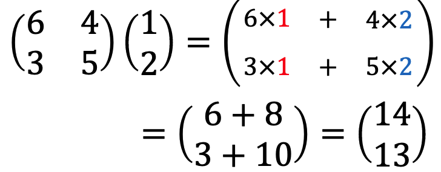

# 応用数学
## 要点のまとめ
#### 1.線形代数
* 学習の目的  
  固有値・固有値分解の理解

* ベクトルとスカラーの違い  
  スカラー：大きさのみ、四則演算が可能。  
  ベクトル：大きさと向き、２つの情報を持つ。

* 行列とは  
  数値を表形式に並べたもの  
  →スカラー値を表に並べたもの  
    or ベクトルを並べたもの　などの解釈の仕方ができる。  
   
  用途：ベクトルの変換や、連立方程式の解を求めるなど。
  
* 2元1次方程式  
  １つの式では解は１つに定まらない。
  ただし、２変数の関係性はわかる。
  
* 連立方程式への行列の利用  
  行列を使えば連立方程式を簡単な式(行列とベクトルの積)で表現できる。  
  
* 行列とベクトルの積  

* 行列同士の積  
後ろの行列をベクトルを横に並べたものと考えると、前項と同じように計算できる。
  

* 連立方程式の解き方  
  行列を用いない表現の場合：行基本変形  
  行列表現の場合：行列の変形  
   
  
  
* 連立方程式への逆行列の利用  
   
  
  を解くことを考えるとき  
   
    
  となる行列Bがわかれば  
   
    
  
  となり、
  
  を解く感覚で連立方程式の解を求められる。  
   
  このとき、行列Bを行列Aの逆行列という。  

* 単位行列と逆行列  
    
   
  行列Iを単位行列といい  
   
  が成り立つ。(互いとって相手が逆行列なので入れ替えが利く。)
  
