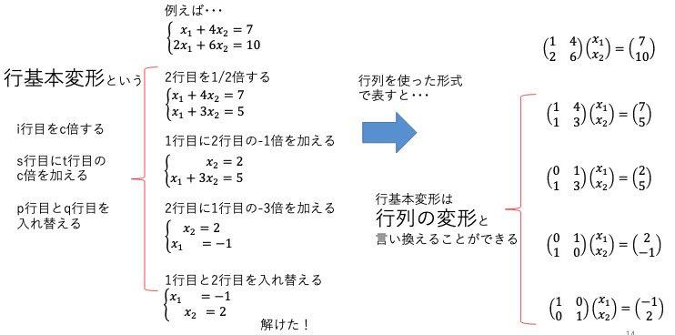

# 応用数学
## 要点のまとめ
#### 1.線形代数
* 学習の目的  
  固有値・固有値分解の理解

* ベクトルとスカラーの違い  
  スカラー：大きさのみ、四則演算が可能。  
  ベクトル：大きさと向き、２つの情報を持つ。

* 行列とは  
  数値を表形式に並べたもの  
  →スカラー値を表に並べたもの  
    or ベクトルを並べたもの　などの解釈の仕方ができる。  
   
  用途：ベクトルの変換や、連立方程式の解を求めるなど。
  
* 2元1次方程式  
  １つの式では解は１つに定まらない。
  ただし、２変数の関係性はわかる。
  
* 連立方程式への行列の利用  
  行列を使えば連立方程式を簡単な式(行列とベクトルの積)で表現できる。  
  
* 行列とベクトルの積  
    

* 行列同士の積  
後ろの行列をベクトルを横に並べたものと考えると、前項と同じように計算できる。  

* 連立方程式の解き方  
  行列を用いない表現の場合：行基本変形  
  行列表現の場合：行列の変形  
   
  
  
* 連立方程式への逆行列の利用  
   
  
  を解くことを考えるとき  
   
    
  となる行列Bがわかれば  
   
    
  
  となり、
  
  を解く感覚で連立方程式の解を求められる。  
   
  このとき、行列Bを行列Aの逆行列という。 

* 逆行列の求め方  
    
  の逆行列
  
  は  
   
    
  で表される。(ただし、)

* 単位行列と逆行列  
   
    
   
  行列Iを単位行列といい  
   
  が成り立つ。(互いとって相手が逆行列なので入れ替えが利く。)

* 行列式  
   
    
  としたとき、
  
  によってできる平行四辺形の面積を行列式といい、
  
  で表す。
  
* 行列式の特徴  
  (1) 同じ行ベクトルがあると0になる。(連立方程式の解がなくなるイメージ)  
  (2) １つの行ベクトルがn倍されると、行列式の値もn倍される。(図形の1辺がn倍されると、面積がn倍されるイメージ)  
  (3) ある行ベクトルに別の成分が加わっている場合、行列式の和に変形できる。  
   
    
  
* 行列式の計算  
  (ⅰ) 2×2の行列の場合  
    
  (ⅱ) 3×3の行列の場合
  色々な導出方法がある。  
  ex.) 余因子展開による次元数を落としての計算

* 逆行列と行列式  
  ある行列の行列式が0であるとき、その行列は逆行列を持たない。
  
* 固有値と固有ベクトル  
  ある行列Aについて、
  
  を満たすλと
  
  があるとき  
  λを固有値、
  
  を固有ベクトルという。  
   
  注：固有ベクトルはその定数倍のベクトル全てが固有ベクトルとなるため、一意に定まらない。
  
* 固有値分解  
  n×nの正方行列Ａが固有値
  
  , 
  固有ベクトル
  
  をもつとき、  
  
  とすると、  
  
  が成り立ち、
  
  と表せる。  
  この変形を固有値分解という。（ある行列を「その固有値と固有ベクトルで表現できる」ということ。）

* 特異値分解  
  正方行列でない行列に行う固有値分解のようなもの。  
   
  ある正方行列でない行列Mについて、  
  
  と変形することを意味する。  
   
  U, Vはそれぞれ
  
  , 
  
  を固有値分解した際の固有ベクトルから、  
  Sはその際の固有値から導出できる。  
  (
  
  , 
  
  は共に正方行列のため、固有値分解が可能)  
   
#### 2.確率・統計
* 集合と要素  
  集合：モノの集まりのこと。  
  要素：モノ１つ１つのこと。これ以上細分化出来ない最小単位。  
   
  要素a, b, cを含む集合Sは数学的には以下のように表される。  
   
    
   
  
  , 
  
  , 
  
  
* 部分集合  
   
  
  のように、前項Sの一部分と表せる集合があるとき  
  「MはSの部分集合である」
  といい  で表す。
   
   
