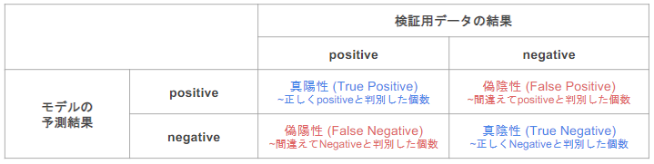

# 機械学習
## 要点のまとめ
#### 0.はじめに
* 学習の目的  
  ・基本的なモデリング手法の理解  
  ・機械学習モデリングの流れの理解  
  
* 機械学習とは  
  タスクTを性能指標Pで測定し、その性能が過去の経験Eにより改善される時  
  T, Pに関してEから学習する、と言う。  
  (Tはアプリにさせたいこと、Eはデータのイメージ)

* 機械学習モデリングプロセス  
  （１）問題設定  
  （２）データ選定  
  （３）データの前処理  
  （４）機械学習モデルの選択  
  （５）モデルの学習  
  （６）モデルの評価  
   
  \*そもそも（１）の時点で機械学習でなくて良い、となる場合もある。  
   

* 機械学習のデメリット  
  ・技術負債が大きい  
  ・テストが難しいケースがある  
 
  
#### 1.線形回帰モデル
* 線形回帰モデルとは  
  ・回帰問題用のモデル  
  ・回帰問題：ある入力（離散値or連続値）から出力(連続値)を予測する問題のこと  
  ・回帰で扱うデータ  
    （ⅰ）入力：説明変数、あるいは特徴量と呼ぶ(m次元ベクトル)  
    （ⅱ）出力：目的変数(スカラー値)  
     
    　以下のように表すことがある。  
    　説明変数：  
    　目的変数：  

  ・教師あり学習  
   　教師データ：  
 
  ・入力とm次元パラメータの線形結合を出力するモデル
  　慣例として、教師データと区別するために予測値にはハットをつける。(ex. )  
   
  　パラメータ：各特徴量が予測値に対してどのように影響を与えるかを決定する「重み」の集合  
   　  
     
  　線形結合：入力とパラメータの積+切片  
   　  
   
  ・説明変数が１次元の場合、単回帰モデルと呼ぶ。  
  ・説明変数が多次元(2次元以上)の場合、重回帰モデルと呼ぶ。  
  
* データの分割とモデルの汎化性能  
  ・データの分割
  　学習用データ：学習に用いるデータ  
  　検証用データ：学習済みモデルの精度を検証するためのデータ  
    
  ・分割する理由  
  　モデルの汎化性能を図るため。  
  　汎化性能を測るには未知のデータが必要。そのため、データの一部を検証用に残しておく。  
  
* 最小二乗法  
  ・パラメータの推定は最小二乗法を用いる。  
  ・平均二乗誤差(MSE)を最小にするパラメータを提案することで学習を進める。  
  
* 最尤法  
  ・線型回帰は最尤法でも解析的にパラメータの推定が可能。  
  　その際の結果は、最小二乗法を用いた結果と一致する。  
 

#### 2.非線形回帰モデル
* 非線形回帰モデルとは  
  複雑な非線形構造を内在する現象に対して使用するモデル  
  
* 基底展開法  
  ・回帰関数として基底関数を使用する手法  
  ・既知の非線形関数とパラメータベクトルの線型結合を行う。  
  ・未知パラメータは最小二乗法や最尤法で推定(線型回帰と同様)  
   
    
   
  \*代表的な基底関数：多項式関数、ガウス型基底関数、スプライン関数  
  
* 未学習と過学習の対策  
  ・未学習の対策  
  　表現力がより高いモデルを使用する。  
  ・過学習の対策  
  　学習データの数を増やす  
  　不要な基底関数(変数)を削除して表現力を抑止する。  
  　正則化法を利用して表現力を抑止する。  
   
* 正則化法 (罰則化法)  
  ・モデルの複雑さに伴って、その値が大きくなる「正則化項」を課した関数を用意  
  　その値を最小化することで過学習を抑制する手法。  
  ・正則化項(罰則化項)  
  　形状によって種類があり、それぞれ推定量の性質が異なる。  
  　 
  　  
    
   　　 ： 正則化項  
   　　 ： 正則パラメータ  
  
  ・正則化項の役割  
  　なし： 最小二乗法  
  　L2ノルムを利用： Ridge推定量  
  　L1ノルムを利用： Lasso推定量  
   
  ・正則化パラメータの役割  
  　大きくする： 制約が強くなる(罰則がキツくなるイメージ)  
  　小さくする： 制約が緩くなる(0なら正則化項が消失→罰則なし)  
   
* モデルの選択  
  ・基底関数の個数  
  ・基底関数の位置  
  ・基底関数のバンド幅  
  ・正則化パラメータ  
  　これらはどうやって決める？ →　交差検証法(クロスバリデーション)
  
* ホールドアウト法  
  ・手元にあるデータを、学習用と検証用の2つに分ける手法。  
  ・問題点  
  　大量のデータがないと有効でない。(学習用の割合を増やしすぎるとテストの精度が落ちる。逆も然り。)  
  　分けたデータに偏りがあると学習がうまくいかない。(エラーデータが検証データに固まると、精度が悪く出てしまうなど)  
   
* 交差検証法(クロスバリデーション)  
  ・データをk個グループに分けて1つを検証用、残りを学習用とする。  
  ・イテレータごとに検証用のデータを変えて、k回だけイテレータを回す。(全データが１度は検証用として使われる。)  
  ・各イテレータで出た精度の平均をCV値と言い、そのモデルの汎化性能を表す。  
  
  　\*計算量は増えてしまうが、少ないデータで精度の高いモデルの評価が行える。  
 

#### 3.ロジスティック回帰モデル
* ロジスティック回帰モデルとは  
  ・分類問題に対するモデル  
  ・分類問題で扱うデータ  
    （ⅰ）入力： m次元ベクトル  
    　  
    （ⅱ）出力： 0 or 1 の値  
    　  
    (ⅲ)教師データ: 0 or 1 の値  
    　  

  ・入力とm次元パラメータの線形結合をシグモイド関数に入力する。  
  　出力はy=1となる確率。  
  ・パラメータが変わるとシグモイド関数の形が変わるイメージ。  
  ・シグモイド関数の性質(連鎖律)  
  　シグモイド関数の微分はシグモイド関数自身で表せる。  
  　数ある0〜1出力の関数からこの関数が選ばれるのはこれが理由(最尤法の微分時に有用)  
    
  ・出力について  
  　  
   　Yは確率Pが0.5以上なら1と予測。0.5未満なら0と予測する。  
    
* 最尤推定  
  ・データを元にその分布のパラメータを推定するという手法  
  ・尤度関数  
  　データを固定し、パラメータを変化させる。
  　尤度関数を最大化するようなパラメータを選ぶ推定方法を最尤推定という。
    
   　  
    　pを未知数として、左辺で得られたデータを元に尤もらしいpを求める。  
    
  ・尤度関数を最大とするパラメータの探索  
  　微分が楽になるため、対数を取る場合が多い。(最大点は変わらないため問題なし)
   
* 確率的勾配降下法(SGD)  
  ・データを1つランダムに選んでパラメータを更新する手法。  
  ・通常の勾配降下法より1回のパラメータ更新に必要な計算量を抑えられる。  
  
* モデルの性能指標  
  ・混同行列  
  　モデルの予測結果を4つの観点で分類したもの。  
  　各結果に当てはまる個数を記載する。  
     
   
* 分類の評価法  
  ・正解率  
  　正解した数 / 予測対象となったデータ数  
  　もっともよく使われる。  
  　ただし分類期の場合、データに偏りがあるとそのデータばかり答え、結果がよく見えてしまう問題点がある。  
   
   ・再現率(Recall)  
  　本当にPositiveなものからPositiveと予測できる割合のこと。  
  　病気の検診など、抜け漏れがないことを重視する場合に利用される。  
  　  
    
   ・適合率(Precision)  
   　モデルがPositiveと判定したもののうち、本当にPositiveだったものの割合のこと。  
   　スパムメールの判定等、見逃しが多くとも正確性を重視する場合に利用される。  
   　  
    
    ・F値  
    　RecallとPrecisionの調和平均。  
     　タスクがわからなく、RecallとPrecisionのどちらに比重を置くべきか判断できない時に利用する。  
 
      
#### 4.主成分分析

* 主成分分析とは  
  ・次元削減を行うための手法。  
  ・極力情報の損失を少なく変量の個数を減らすため、分散が最大になるようにデータの変換を行う。  

* 変換の流れ  
  (1) 中心化したデータ行列を用いて線形変換を行いベクトルを取得する。  
    
  
  (2) 変換後の分散を求めて、ノルム=1 の条件下で最大値を取る係数ベクトルを探索する(ラグランジュ関数を解く)。
  　  
  　ノルム=1を考慮し、  
  　  
  　このをラグランジュ関数といい、これが微分値=0となる点を求めればよい。  
   
  (3) ラグランジュ関数を微分し、最適解を求める。  
  　  
  　  
  これより、  
  　  
   
   \*射影先の分散は固有値と一致する。

* まとめると...  
  上記の流れは以下のようにも表せる。  
  (1) 元データの分散共分散行列を計算する。  
  (2) その行列に対して固有値分解問題を解く。  
  (3) 最大m個の固有値と固有ベクトルが求まり、それが各主成分となる。  
  　　\*k番目の固有値を昇順に並べ、対応する固有ベクトルを「第k主成分」と呼ぶ。  

* 寄与率  
  ・次元圧縮後の情報損失を調べるための値。  
  ・第k主成分の分散の、全分散に対する割合で表される。  
  ・第k主成分がもつ情報量の割合と捉えることができる。
  
  　  
  
  ・第1〜k主成分まで圧縮した際の寄与率を累積寄与率という。  
  　  
   
  
#### 5.アルゴリズム
* k近傍法 (kNN)  
  ・教師あり学習  
  ・分類を行うための手法。  
  ・対象データから見た最近傍のデータをk個取ってきて、それらが最も多く所属するクラスに分類する。  
  　ex.) k = 3 のとき  
  　　　識別したいデータに近いデータを3つとってきて、その3つで多数決を行う。  
  　　　その結果、一番多かったクラスに所属すると判定される。  
      
  ・kの値によって結果が変わる。(kは予め決めておくハイパーパラメータ)  

* k-平均法 (k-means)  
  ・教師なし学習  
  ・クラスタリング手法  
  ・与えられたデータをk個のクラスタに分類する。  
   
  ・アルゴリズム  
  　(1) 各クラスタの中心となる初期値を設定する。  
  　(2) 各データ点に対して、各クラスタの中心との距離を計算し、最も近いクラスタを割り当てる。  
  　(3) 各クラスタの平均ベクトル(中心)を計算し、新たな中心とする。  
  　(4) 中心位置が収束するまで(2)(3)を繰り返す。  
   
  ・中心の初期値によってクラスタリングの結果が変わる。  
  　あまり近くに設定してしまうと、うまく分けられないことがある。(k-means++で改善)  
   
   
#### 7.サポートベクターマシン(SVM)
* SVMとは  
  ・2クラス分類のための機械学習手法。  
  ・線型モデルの正負で2値分類を行う。  

s
s

