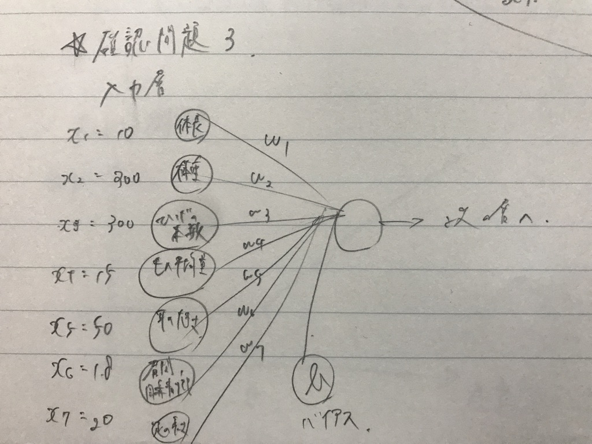
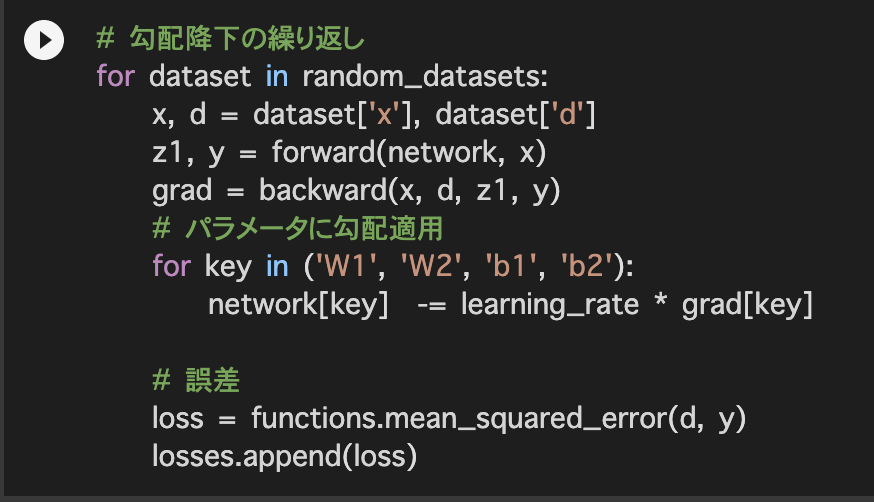

# 深層学習 Day1, 2
## 要点のまとめ

#### Day1-0.ニューラルネットワークの全体像

* 識別モデルと生成モデル  
  ・識別モデル  
  　目的：データを目的のクラスに分類する。(データ→クラス)  
  　計算結果：  

  ・生成モデル  
  　目的：特定のクラスのデータを生成する。(クラス→データ)  
  　計算結果：  

* 識別器の開発アプローチ  
  ・生成モデル  
  　を推定する。  
  ・識別モデル  
  　を推定する。  
  ・識別関数  
  　入力値xを直接クラスに写像する関数f(x)を推定する。  
  　データをクラスに分類する点では識別モデルと同じだが、クラスに属する確率はわからない。(最も確率の高いクラスのが出力)  
 
 * ニューラルネットワーク(NN)でできること  
  ・回帰：結果予測、ランキングなど  
  ・分類：写真の判別、文字の認識、種類の分類など  
  ・一般に中間層が4層以上のNNを深層NNと呼ぶ。  

#### Day1-1.入力層〜中間層

* 入力層と中間層  
  ・入力層に入ってくる入力値は、重みによる補正を受け中間層に伝わる。  
  ・各入力層から出力された値は総和され、さらにバイアスが加わった上で中間層の入力値となる。  
  ・中間層に入力された値は、活性化関数を通され中間層の出力となる。  
  ・入力層の出力  
  　  
  ・中間層の出力  
  　  
  　  

#### Day1-2.活性化関数

* 活性化関数とは  
  ・NNにおいて、次の層への出力の大きさを決める非線形の関数のこと。  
  ・入力値に応じて、次層への伝達のON/OFFあるいは強弱を定義できる。  
  
* 中間層用の活性化関数  
  ・ステップ関数  
  　閾値を超えたら発火する関数。  
  　出力は常に0か1になる。  
  　過去にパーセプトロンで使われた実績があるが、現在はほとんど使われることはない。  
  　  
   
  ・シグモイド関数  
  　0〜1の間を緩やかに変化する関数。  
  　信号の強弱を伝えられ、このことがNN普及のきっかけとなった。  
  　ただし、勾配消失問題を引き起こす課題がある。  
  　  
   
  ・ReLU関数  
  　今最も使われている活性化関数  
  　シグモイド関数が抱えていた勾配消失問題の回避と、スパース化に貢献することで良い成果をもたらしている。  
  　&space;0)\\&space;0\,\,\,\,(x\leq&space;0)&space;\end{matrix}\right." title="f(x)=\left\{\begin{matrix} x\,\,\,\,(x> 0)\\ 0\,\,\,\,(x\leq 0) \end{matrix}\right." />  
   
#### Day1-3.出力層

* 出力層とは  
  ・モデルが最終的な値を出力する層のこと。  
  ・中間層が次の層への入力を出力するのに対し、出力層は最終的に欲しい値を出力する。  

* 学習の流れ  
  (1) 訓練データを用意  
  (2) 適当な重みでNNにデータを通す。  
  (3) 出力値を正解値と比べ、誤差を求める。  
  (4) 誤差が0になるようにパラメータ(重み)を修正する。  
  
* 誤差関数  
  ・二乗和誤差  
  　  
  ・交差エントロピー誤差  
  　  
   
* 出力層の活性化関数  
  ・中間層との違い  
  　値の強弱  
  　中間：信号の強弱を調整する。  
  　出力：信号の大きさ(比率)はそのままに変換する。  
  ・確率出力  
  　分類が目的なら全総和が1になるようにする。  

* 出力層で使用される活性化関数  
  ・恒等関数  
  　回帰で使用する。  
  　入力値をそのまま出力する。  
  　セットで使用する誤差関数：二乗和誤差  
  　  
  
  ・シグモイド関数  
  　二値分類で使用する。  
  　セットで使用する誤差関数：交差エントロピー誤差  
  　  
   
  ・ソフトマックス関数  
  　多クラス分類で使用する。  
  　セットで使用する誤差関数：交差エントロピー誤差  
  　  
#### Day1-4.勾配降下法

* 深層学習の目的  
  ・学習を通して誤差を最小にするネットワークを構築する。  
  　手法：勾配降下法でパラメータを調整する。  
  
  ・数式モデル  
  　  
   
  　：学習率  
   
  ・学習率について  
  　大きすぎる場合：発散してしまい、いつまで経っても学習が終わらなくなる。  
  　小さすぎる場合：発散のリスクは減るが、学習に時間がかかってしまうor局所解で学習が終わるリスクが増す。  
   
* 確率的勾配降下法(SGD)  
  ・学習サンプルを全て使わず、ランダムに抽出したサンプルで学習を行う手法。  
  ・メリット  
  　データが冗長な場合の計算コストを抑えられる。  
  　局所極小解に収束するリスクを抑えられる。  
  　オンライン学習ができる。(１度に全データを投入せず、逐次的に投入してパラメータを更新する手法)  
   
* ミニバッチ勾配降下法  
  ・バッチ学習  
  　全データを一気に学習する手法。  
  　全データをメモリに対して一度に載せてしまう必要がある。  
  ・数式モデル  
  　  
  　  
  　  
   
  ・特徴  
  　ランダムに分割したデータの集合に属するサンプルの平均誤差で学習を行う。  
  ・メリット  
  　SGDのメリットを損なわず、計算機の計算資源を有効利用できる。  
   
#### Day1-5.誤差逆伝播法

* 誤差逆伝播法とは  
  ・誤差を出力層側から順に微分し、前の層へ伝播させていく手法。  
  ・最小限の計算量で各パラメータでの微分値を解析的に計算する。  
  ・微分値の計算には微分の連鎖律を利用する。  
  ・計算結果(=誤差)から微分値を逆算することで、不要な再起的計算を避けて微分値を算出できる。
  
* 入力層の設計  
  ・入力値として取りうるデータ  
  　連続する実数値  
  　確率  
  　フラグ値(one-hotラベル)  
  ・入力層として受け取るべきでないデータ  
  　欠損値が多いデータ  
  　誤差の大きいデータ  
  　出力そのもの、出力を加工した情報  
  　連続性のないデータ(背番号など)  
  　無意味な数が割り当てられているデータ  

* 欠損値の扱い  
  ・入力として採用しない。(その列のみ除外)  
  ・欠損値を含む入力データを除外（その他の系列データも含めて１行丸ごと削除）  

* 数値の正規化・正則化  
  正規化：全データを0〜1の範囲に収めること。  
  正則化：正則化項を導入し、過学習を防ぐ手法。
  
* 過学習  
  ・訓練データに適応しすぎた状態のこと。  
  ・巨大なｘNNで発生しやすい。  
  ・訓練誤差とテスト誤差を見ることで発生の有無を判別可能。  
  ・ドロップアウト法など、回避するための様々な手法が提案されている。  
  
* データ集合の拡張  
  ・学習データが集まらない時に、人工的にデータを水増しする手法。  
  ・分類タスク(特に画像認識)に効果が大きい。(密度推定などではNG)  
  ・中間層にノイズを注入することでも可能。  
  ・拡張を行った学習の方が汎化性能が上がることが多い。  
  ・データ拡張まで含めてモデルの一部とすることが一般的。  
  
* 転移学習  
  ・既に学習済みのモデルを利用して、タスク固有処理のみモデルを作成する手法。  
  ・開発コストの大きい特徴量の抽出をスキップすることで開発のパフォーマンスの向上が見込める。  

#### Day2-1.勾配消失問題

* 勾配消失問題とは  
  ・誤差逆伝播法が下位層に進むにつれて勾配が緩やかになっていく。  
  　それによりパラメータの更新ができず、最適解にたどり着けなくなる現象のこと。  
  ・活性化関数にシグモイド関数を使用する場合の課題。
  　シグモイド関数の微分値は最大で0.25であり、連鎖律で掛け合わされていくと0に近づいていってしまうため。  
  ・その点でReLU関数は優れているため、現在の主流となっている。  
  
* 重みの初期値設定  
  ・重みの初期値をランダムに設定すると、値の偏りなどが原因で学習がうまくいかなくなる場合がある。  
  ・解決策としていくつかの手法が提案されている。  
  　(1) Xavierの初期値  
  　　重みの要素を、1つ前の層のノード数の平方根で割った値に設定する。  
  　　共に使用される活性化関数：ReLu、シグモイド、双曲線正接  
    
  　(2) Heの初期値  
  　　重みの要素を、1つ前の層のノード数の平方根で割り、さらにを掛け合わせた値に設定する。   
  　　共に使用される活性化関数：ReLU  
    
* バッチ正規化  
  ・ミニバッチ単位で入力値データの偏りを抑制する手法。  
  ・活性化関数に値を入れる前後どちらかにバッチ正規化を行う層を加える。  
  ・計算の高速化と勾配消失問題の回避が見込める。  
  
#### Day2-2.学習率最適化手法

* 学習率の決め方  
  ・初期は以下の指針で決めていた。  
  　最初は大きく、徐々に小さくしていく。  
  　パラメータごとに可変。  
  ・現在は様々な最適化手法が提案されている。  
  
* モーメンタム  
  ・勾配降下に物理的な慣性力の概念を組み合わせたもの。  
  ・メリット  
  　局所的最適解にならず、大域的最適解になる。  
  　谷間に着いてから最も低い位置(最適解)にいくまでの時間が早い。(坂を転がり落ちて加速するイメージ)  
  　　  
  　　  
  慣性：  
  
* AdaGrad  
  ・誤差の微分値によって算出されるパラメータによって再定義される学習率を使用する手法。  
  ・メリット  
  　勾配が緩やかであっても最適解に近づける。  
  ・ただし、鞍点問題が発生しやすくなる欠点がある。  
  　　  
  　　  
  　　  
  
* RMSProp  
  ・学習時の振動を抑制する手法。  
  ・RMSPropとは異なるモデルで再定義された学習率を使用する。  
  ・メリット  
  　局所的最適解にならず、大域的最適解になる。  
  　ハイパーパラメータの調整が必要な場合が少ない。  
  　　  
  　　  
  
* Adam  
  ・モーメンタムとRMSPropを組み合わせた手法。  
  ・現在主流の最適化手法。  
  
#### Day2-3.過学習

* 過学習とは  
  ・テスト誤差と訓練誤差に乖離ができてしまうこと。  
  ・原因  
  　パラメータが多い。  
  　パラメータの値が適切でない。  
  　ノード数が多い。  
  　etc...  
  ・要するにネットワークの自由度が大きいと発生しやすい。(訓練データにフィットしすぎる)  
  
* 正則化  
  ・過学習対策。  
  ・ネットワークの自由度を制約する手法。  
  ・L1正則化、L2正則化がある。(後述)  
  
* Weight decay (荷重減衰)  
  ・過学習の原因  
  　重みが大きい値をとることが可能性の１つとしてある。  
  　誤差に正則化項を加える事で、重みの肥大化を抑制すれば良い。  
  　理想は大きさを押さえつつ、ばらつきを生むこと。  
   
* L1, L2正則化  
  誤差関数にpノルムを加える。  
    
    
  　：減衰係数 (大きいほど制約がキツくなる)  
  　p=1 の時：L1正則化  
  　p=2 の時：L2正則化 と呼ぶ。  

* ドロップアウト  
  ・過学習の原因  
  　ノード数が多い → 減らせばよい：ドロップアウト手法  
   
  ・手法  
  　ランダムにノードを削除して学習を行う。  
  　閾値を設定して、それを超えたノードを削除する。  
   
  ・メリット  
  　データを変えずに、擬似的に異なるモデルの学習を行える。(擬似的なアンサンブル学習)  
   
#### Day2-4.CNN

* CNNとは  
  ・Convolutional Neural Network のこと。    
  ・畳み込みという処理を用いる、順伝播型のNN。  
  ・主に画像や動画認識に使用される。  
  
* CNNの構造例   
  (入力層)→(畳み込み層)→(畳み込み層)→(プーリング層)→(畳み込み層)→(畳み込み層)→(プーリング層)→(全結合層)→(出力層)  
  
* 畳み込み層  
  ・入力値 → フィルター(重み) → 出力値+バイアス → 活性化関数 → 最終出力  
  ・縦・横・チャネルの3次元データをそのまま学習し、次に伝えることができる。  
  
* パディング  
  ・出力画像が入力画像と同じサイズになるように入力画像に加える処理。(通常、畳み込み処理は画像サイズが小さくなってしまう)  
  ・最もメジャーなのはゼロパディング。  
  　画像の周りを0で囲む。(元画像に影響を与えにくい)  
   
* ストライド  
  ・畳み込み処理時にフィルターをずらす幅のこと。  
 
* チャンネル  
  ・入力画像のもつ奥行きの数のこと。(ex. RGBの３チャンネル )  
  ・チャンネルの数だけフィルターを用意する。  
  ・既存のネットワークでは1チャネルしか扱えず、RGBについて学習できなかった。  
  
* im2col  
  ・多次元データを2次元配列に変換する。  
  ・行列に落とし込むことで多くのライブラリを活用できるようになる。  
  
* プーリング層  
  ・入力画像について重要な情報を残しつつ縮小する処理を行う層。  
  ・入力画像の対象領域について、Max値or平均値を取得し画像を縮小する。  

#### Day2-5.AlexNet

* AlexNetとは  
  ・Hinton教授らのチームによって発表された物体認識モデル。  
  ・2012年のILSVRCの優勝モデル。  
  
* AlexNetの構造  
  ・5層の畳み込み層とプーリング層、それに続く3層の全結合層から構成される。  
  ・過学習対策にサイズ4096の全結合層の出力にドロップアウト法を採用している。  
 

## 確認テスト

#### Day1

* PDF スライド5  
  ・自身の考察
  　与えられた入力データを適切な結果に変換するための演算に必要なパラメータを  
  　自力で学習し、変換用の数式モデルの構築を目的としている。  
  　最適化するパラメータ：重み[W]、バイアス[b]  

* PDF スライド7
  ・自身の考察  
  
 
* PDF スライド13  
  ・自身の考察  
  

* PDF スライド15  
  ・自身の考察  
  
  
* PDF スライド17  
  ・自身の考察  
  

* PDF スライド20  
  ・自身の考察  
  

* PDF スライド27  
  ・自身の考察  
  
  
* PDF スライド38  
  ・自身の考察  
  　Q.引き算ではなく2乗する理由  
  　A.正解値とのズレを性の値にしたいため。(正と負のズレで相殺するのを避ける)  
  　Q.係数の1/2はどういう意味をもつのか  
  　A.微分した際に出てくる係数2を相殺するため。  

* PDF スライド45  
  ・自身の考察  
  
  
* PDF スライド47  
  ・自身の考察  
    

* PDF スライド50  
  ・自身の考察  
  

* PDF スライド59  
  ・自身の考察  
  　モデルに全データを１度に与えず  
  　逐次的にデータを投入し、パラメータを更新していく手法のこと。

* PDF スライド62  
  ・自身の考察  
  

* PDF スライド71  
  ・自身の考察  
  

* PDF スライド76  
  ・自身の考察  
  

 

#### Day2

* PDF スライド12  
  ・自身の考察  
  　  

* PDF スライド20  
  ・自身の考察  
  　,  
  　
    
  　
  　
* PDF スライド28  
  ・自身の考察  
  　重みを0にしてしまうと入力値がどのような値であっても同じ値が出力されることになる。  
  　そのため、入力データの違いによる学習の進行が期待できなくなってしまう。  

* PDF スライド31  
  ・自身の考察  
  　・計算処理の高速化。  
  　・勾配消失が起きにくくなる。  

* PDF スライド47  
  ・自身の考察  
  　モーメンタム：SGDに移動平均を適用して振動を押さえた手法。  
  　AdaGrad：過去の勾配と異なる値をとったパラメータに対して敏感に更新をかける手法。  
  　RMSProp：勾配の大きさに応じて学習率を調整し振動を抑える手法。  

* PDF スライド63  
  ・自身の考察  
  　(a)：リッジ回帰は減衰係数を大きくすると、全ての重みが0に近づく。(ただし、0にはならない)  

* PDF スライド68  
  ・自身の考察  
  　L1正則化：Lasso推定量を使用するので右の図が正解。  

* PDF スライド100  
  ・自身の考察  
  　  
  　  
  　　よって、出力サイズは7\*7になる。  

## 実装演習結果

[DNN_Day1 実装演習結果](/practice/実装演習_DNN_Day1.md)  
[DNN_Day2 実装演習結果](/practice/実装演習_DNN_Day2.md)
